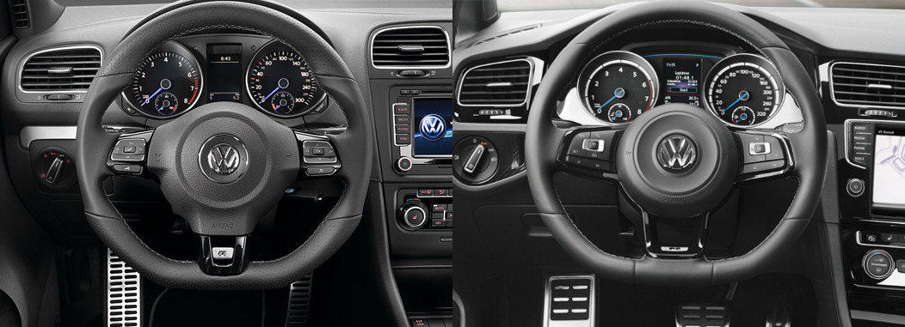

Покатался два дня на машине 2017-ого года - тоже белой, с пробегом в 20+ тысяч, на ручке и с performance package: диф и тормоза от R. Думал покупать или нет, но отказался в итоге от этой идеи.

Наблюдения:
- в первую очередь пришлось спустить давление в шинах - были накачаны по спеке. 37psi и это полный привет. Скачет как мяч. У меня обычно 32psi вместо 36.
- есть ощущение что новая машина немного жестче и собраннее. В экстремальных условиях или с выключенной ESP покататься не удалось.
- тормоза просто огонь - цепляют сразу и управляются давлением на педаль, а не глубиной нажатия (по крайней мере на обычных скоростях)
- кнопка старт/стоп и открытие без ключа это очень удобно
- стандартная музыка на голову лучше звучит чем в MK6
- понятно (американский стандарт) что вместо европейских зеркал с двумя зонами стоят плоские с обеих сторон и это не удобно
- интерьер выглядит намного более современно и <i>глянцево</i>. На любителя.
- даже с настройкой <i>normal</i> колонки имитируют звук двигателя, что раздражает. Если бы я четыре года не ездил на MK6 и мне не с чем было сравнить скорее всегон не заметил бы.
- странно выглядят двери с вырезом под стеклянные треугольники. Да и сами треугольники.
- руль и кнопки на нём категорически не понравились - даже посмотрел есть ли другие стандартные руки на MK7, но вроде бы нет. Кажется что диапазон регулировок стал больше - мне не хватает вылета.

- машина не прошита APR, поэтому ленива. Но мощи достаточно, просто приходится ждать. Конечно так ездить постоянно вообще не вариант - надо прошивать.
- клетчатые сидушки прикольные
- MPG получше процентов на десять

С учётом того что пересесть со своей на эту машину стоило бы мне $10К я решил не заморачиваться. Несмотря на полтора года гарантии, дифф и отсутствие ненавистного люка (мой уже не закрывается). Дизайн шестерки мне ближе что внутри что снаружи и это тоже сыграло свою роль. Хотя красный или серебристый семёрке очень идёт.

По бумаге и многим отзывам получается что MQB платформа вообще огонь, и EA888 3-rd gen во всём лучше своего предшественника. У меня тоже особых претензий нет - всё немного но лучше. Но для spirited езды по серпантинам мне шестёрки хватает.

Конечно два дня это ни о чём, но я взамен оставил свой GTI, а в нём на второй день наелась катушка. Так что пришлось меняться обратно раньше времени.

Опыт напомнил об моём <a href="https://www.drive2.ru/b/2590231/">тест драйве R-ки шестого поколения</a> несколько лет назад со сожим выводом - машина прикольная, но не на 10K доплаты.

<b>P.S.</b> Интересное наблюдение - при резком нажатии педали у меня в MK6 чувствуется небольшой толчок, как будто мотор выбирает свободный ход подушки и немного ударяется о что-то. Точно такая же штука в почти новом MK7. Что это и что с этим делать? Немного раздражает.
