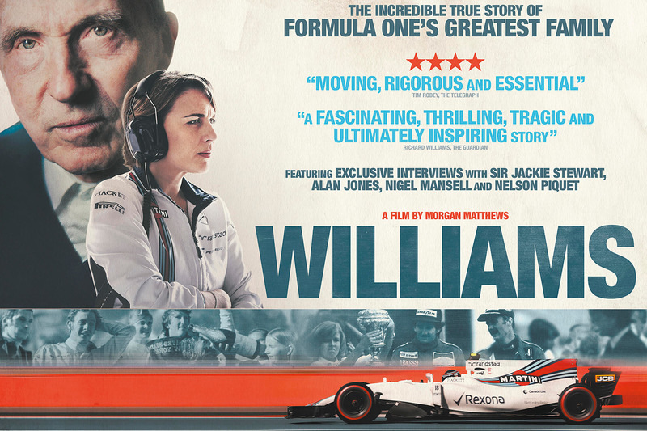
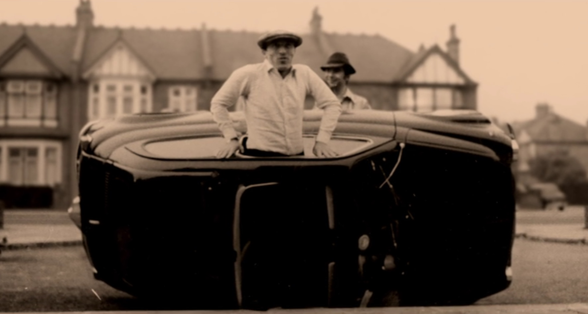
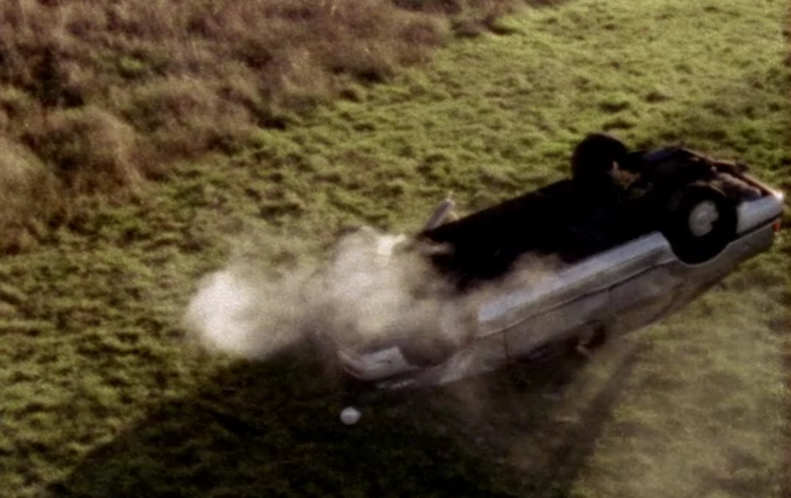
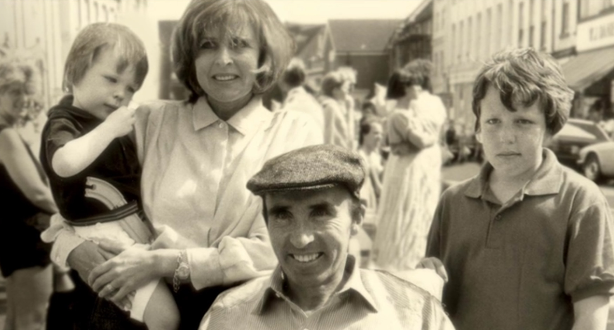
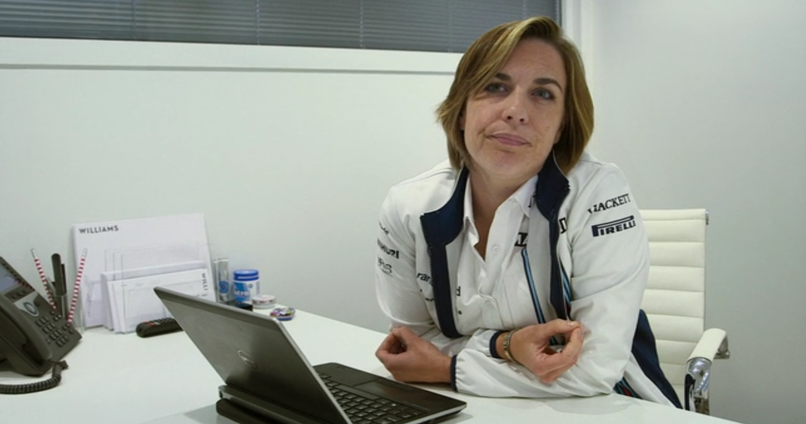
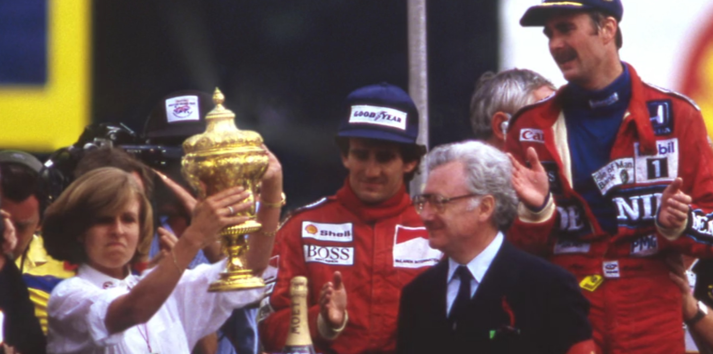

Great British documentary on Williams F1 team history tightly intertwined with Williams family story. Must see if you enjoy watching dramas, interested in Williams F1 team history or have appreciation for life complexities in general. Especially if such life is running at the rev limiter for a good chunk of time. <b>Spoiler alert!</b>

Movie is based on family member interviews, newspapers of the time and audio recordings of Ginny (Frank’s wife) conversations with Pamela Cockerill for the her book <i>A different kind of life</i> first published in 1991.

All starts with Frank’s early career as a racing driver who is <i>lightning fast but is not always staying on the road</i>. To keep racing he acts as an engineer, vehicle parts and racing car dealer who could sell the same racing car repainted as a new one for three years in a row to some loyal customer.

Every one of us has probably seen Frank in the wheelchair. But were you ever curious enough to figure what had happened? I wasn’t. Apparently accident had nothing to do with professional racing but curvy B-road and <i>Ford Sierra 1600</i> rented at Avis rental. Without Ginny vigorously taking control over the situation most likely he would have died in France hospital in 1986.

Ayrton Senna died on May 1 1994 in Williams FW16 on Imola. He commented before the accident on the fact that he can not fully trust the car. That was his first season with Williams after six consecutive years at McLaren...

Racing got in the way of the family life quite a bit:
&#8226; Ginny (Virginia Williams): <i>He hasn’t got any interests outside motor racing. He doesn’t read. He really doesn’t have anything going on in his life at all, apart from motor racing.</i>
&#8226; Ginny: <i>We’ve been living together for two years and I don’t think he considered that he had any obligation towards me. And there was a limit to how long I felt I wanted to go along with that. I did get pregnant with the idea of forcing the issue.</i>
&#8226; Frank Williams: <i>Motor racing is what matters most in my life. Well, I have a family which I love very much, but they tend to take the second place to the business, there is no question about that.</i>
&#8226; Claire (Frank’s daughter): <i>Mom always used to tell us: There is no point in having your father here cause he will drive us all mad.</i>
&#8226; <i>I remember Ginny gave him eight pounds once to go and buy some fish and chips I think. And he went on and bought eight champion sparking plugs and never came back for three days.</i>

Despite all Frank’s dedication and Ginny’s sacrifices team wasn’t always running smooth: <i>There used to be a joke among the drivers: if you want to wreck your career drive for Williams</i>. Occasionally they even had to use second hand tires and not all parts were readily available for the cars placed on the grid.

In 2013 Frank’s daughter Claire Williams gets appointed as a deputy principal of the F1 team. At the same time Claire’s oldest brother Jonathan runs the Williams Heritage department and it’s hardly surprising that he is not very happy about it. Same year Ginny passed away from cancer.

On this point you might be thinking that Williams team was always mixed up or even a failure. But they had a fair amount of happy moments such as an aerodynamic skirt of 1979 which lead to team dominance throughout the early 80th and Nelson Piquet taking Brazilian Grand Prix shortly after Frank’s accident. 1986 overall was very successful year for team which had won Constructors Championship and only blown tire on Nigel Mansell’s car during the last race of the season prevented them from taking Drivers’ championship as well. Mid 90th success is not covered in the movie though.

I found movie to be mostly on the dark side of things but it is deeply touching and enjoyable enough to write this post trying to share Williams history bits with you, dear reader. Cheers and hope you enjoy the movie!

Couldn't find full version on youtube, hence the trailer:

<VideoPlayer src = 'https://www.youtube-nocookie.com/embed/ItTKBbAsLMc'/>
