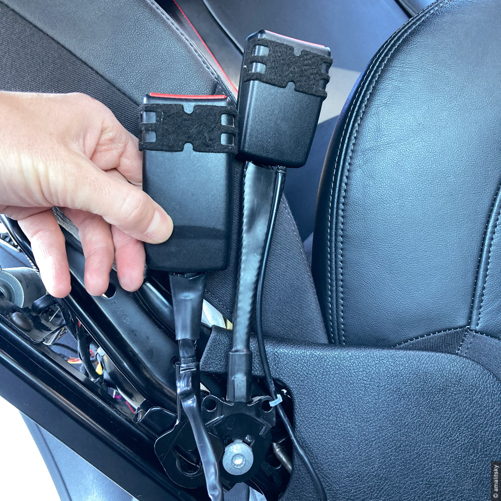

My original GTI leather seats look good and hold me pretty well until I get close to 1 lateral G
on the raceway or canyons!

They have a mechanical lever for the *simultaneous* adjustment of the seat height *and* cushion
angle.
That means that you **can't** keep the seat at it's lowest position and tilt the front edge
of the cushion to the angle you prefer.

Audi B8/B9 Sport/SuperSport seats seem like a decent upgrade.
They look even better and have fully electric and _independent_ seat adjustment controls.
There is an Alcantara version of the seat with suede centers and leather bolstering.
Suede keeps you in place noticeably better, and won't get you
sweaty pants and shirt in summer as easily as non-ventilated leather does.

In fact Alcantara seat center makes getting in and out of the seat a little more cumbersome -
since you can't just drop you butt at any angle and easily slide on the seat afterwards.

Audi SportSeat has an extendable knee pad (support) which I thought was nice to have,
but in reality doesn't work for me at all.
_For the reference, I'm 6 feet tall or about 182cm._

SuperSport seats come in a long list of Audi models: S4, S5, TTS, some TTs
and likely RS models too.
Even recent RS3 generation seats look very similar, hence (in theory) could be installed
into _MK5_/_MK6_/_MK7 GTI_ and, of course, _R_.
Sometimes you can find them on a european pull-a-part salvage yard or online marketplace.

I bought mine on ebay.
Both seats came out of Audi S4 but were taken from different cars -
driver's seat had 2013 production date while passenger's was labeled as 2009.
They look absolutely the same though, and down the line it didn't because any difficulties.
Keep that in mind while hunting for yours!

Before we jump into the installation, let's talk about electric modules of the seat.
Surprisingly (at least for me) there is enough to talk about!

## VW seat Electric Modules 

Seat modules:
- [seat adjustment motors](#seat-adjustment-module) (including lumbar support) and buttons
- seat position memory module (some Audi cars only, as fas as I know not applicable to US GTIs)
- [heating module](#seat-heating-module), heating elements and temp sensors
- [occupancy sensor](#pods-system) - passenger seat only
- [seat belt switch](#seat-belt-buckle-switch) including the passenger belt tension sensor
- [seat position sensor](#seat-position-sensor) - driver seat only on GTI, both sides on Audi
- Audi seat also utilizes the rear passenger footwell light - not applicable to GTI.

Seat is made of two independent steel frames: seat bottom and the backrest.
They can be separated by releasing two _triple square_ bolts on each side
and freeing electric cables to backrest motors.

### Seat Adjustment Module
GTI seat adjustment buttons and motors work together as an independent unit,
meaning that there is no CAN bus connecting them with a comfort control module of the car.

It also means that supplying power and ground wires (protected with an appropriate fuse)
is sufficient to get all the adjustment motors and buttons working.

That's why we will be reusing the internal Audi seat wiring for seat motors and related buttons.

_You can check your seat adjustment motors while seats are out of the car using an
external 12V power supply (i.e. your car or motorcycle battery)._

### Seat Heating Module
Each seat has two heating elements - one in the seat bottom and another one for the backrest.
Temperature sensor is located in the seat bottom.

There is a dedicated heating control module (marked as _J774_ on VW electric schemes)
under the _driver's_ seat, responsible for heating up _both_ seats.
That's right - power for _passenger_ seat heating elements is supplied by this module.

Heating control module is connected with the climatronic and AC control modules of the car.
Those are located somewhere in the dash, but we don't have to deal with them for this install.

### PODS System
Passenger occupant detection system (_PODS_) responsibility is to figure out if the front passenger
airbags should deploy (and, probably, to which extent) when car gets into an accident.
It's control module is located under the passenger seat and uses two sensors to make the call -
pressure sensor mat in the seat bottom and seatbelt tension sensor in the seatbelt buckle switch.

PODS control unit is connected to the _airbag control module_ with two _CAN_ wires.

### Seat Belt Buckle Switch
_Driver's_ seat belt buckle in 2013 VW GTI operates as an _inverted switch_.
Fastening the belt brakes the circuit.

GTI _passenger_ seatbelt switch has _400 Ohm_ resistance when unbuckled.
And it goes down to _100 Ohm_ once buckled in.
Passenger seatbelt also has the belt tension sensor built into it, which operates as a
potentiometer.

### Seat Position Sensor
Installed on the driver's seat rail, seat position sensor communicates seat position to the
_airbag control module_ under the dash to modulate driver's airbag deployment in case of
an accident.

## Seats Installation
<Note type = "warning">

  **Disclaimer:** Use at your own risk! **Don't** consider this information a guidance.

  Interfering with original car electronics and mechanics is risky, not recommended and
  can because a serious injury or death.
  Author doesn't assume any responsibility or risk caused by your actions based on this post.

</Note>

There are two main steps: physically bolting seats down and connecting them with the electric
system of the car.
You might also need to disassemble the Audi seat bottom cushion to retrofit PODS sensor into it.

Mechanically Audi B8/B9 seat is _almost_ a direct fit for the VW Golf platform.
All you need is to cut one of the seat positioning pins from the outer seat rail.
Both Audi and VW use two positioning pins sticking out of the seat rails.
However, VW places _both_ positioning pins on the _inner_ seat rail while Audi places
_one_ positioning pin at the end of _both_ rails.

Once the redundant pin is removed (no big deals since its aluminium), Audi seat
can be bolted right into the Golf body using original bolts.

Audi seat backrest is a little wider, taller and beefier than VW seat.
Seat bottom will be almost at the same height, may be half of an inch higher in its
lowest position.
_Which is not good, because GTI seats are sitting pretty high from the factory._

I've experienced some rubbing of an Audi seat against the armrest cover and rear central console.
Nothing to worry about, really, since you can hear it only moving the seat forward and aft.
Folding of rear seats becomes more of a problem, however - you might want to remove those
headrests. _Yep, just like I had to do in my Fiat 500_.

Audi seat is noticeably heavier than the GTI one: 28.5kg vs 24.5kg.
Extra four kilos (nine pounds) doesn't sound like much,
but that does make seats installation significantly more physical.

We will be reusing VW's _heating_ and _PODS_ control modules while leaving Audi seat motors,
buttons and sensors in place.
Generally speaking - all we have to do is to replace seat-to-vehicle connectors.
Most of the "internal" Audi seat wire harness remains in place.

I didn't want to cut my VW seats wire harness and bought two used ones on ebay.
For the best match check labels under your seats, but for 2013 GTI with heated leather
seats and electrical backrest adjustment codes are: _5K0 971 391 R_ for driver's seat
and _5K0 971 392 BC_ for the passenger's.

Theoretically you can get away with buying just seat connectors and using
Audi wires only.
This approach would require more work on the wiring and pins though.

Some Audi seats have seat adjustment memory control modules, and we won't use it
(I doubt that is possible/feasible to use Audi control modules on a Golf platform).

Passenger Audi seat I bought didn't have the occupancy sensor (also called "seat bladder" or mat),
hence I had to buy it (more on that below).
If your seat comes with it, you should be able to reuse it.

### Driver's Seat Installation

#### Seat Adjustment Motors and Buttons
This is probably the easiest part of the installation.

We need to connect red/black and brown wires removed from the red Audi connector with matching
color wires going into the black _T10a_ VW connector (pins 9 and 5 respectively).

And that is it! To make all the adjustments work all we need is to supply power and ground.
All the internal seat wiring between motors and buttons remains as is.

_This step might differ if your Audi or VW seat came with the seat position memory module_.

#### Heating
_Internal_ VW driver's seat wire harness comes with three connectors related to heating:
- _T8z_ - heating module connector
- _T2d_ - backrest heating element
- _T4l_ - seat heating element and temp sensor

Audi seat heating wires can be connected with the main seat harness via single
connection point and backrest will be getting its power supply from there also.

So, we cut off the _T2d_ connector as well as wires coming into it.
Then cut _T4l_ connector and connect four wires going into it with the
Audi seat heating wires (green connector).

| VW Color | Audi Color (green plug) | Description |
| :-- | :-- | :-- |
| green (1mm) | red/white | heater power |
| brown (1mm) | grown  | heater ground |
| black/blue (0.5mm) | black/white | temp sensor power |
| brown (0.5mm) | green/brown | temp sensor power |

Now we can connect and install VW heating module under the seat frame.
Front right section has plenty of space, and two zip ties will keep the module in place.

#### Driver's Seat Buckle Switch
Unfortunately we can't just plug the Audi seat belt buckle wires into the
corresponding VW connector, because Audi uses completely different switch schematics.

Audi buckle switch reads _400 Ohm_ resistance when unplugged which drops to _100 Ohm_ once
the belt is buckled.

While GTI driver's belt switch operates as an inverted switch - it works as a closed
circuit when unlocked and opens up when locked (seat belt fastened).

You might think it should be the other way around: open when unlocked and closed once locked,
but it is, in fact, inverted.

We can't bolt VW buckle switch onto the Audi seat either because their seat rail mounts
are very different:

I decided to leave driver's seat buckle switch connector _T2q_ open (not plugging anything into it).
As far as airbag control module concerned, driver's belt is buckled in at all times.
Personally, I never drive without the belt and don't need a reminder to put it on.

Side effect of this approach is that the red unfastened driver's seatbelt icon
won't appear on the dash when the car ignition is turned on and belt is not yet fastened.
Savvy car buyer might notice that and start asking questions.

Theoretically we can open up both buckle cases and swap the internals.

Yet another option is to find an old Audi seat belt buckle switch which is using the same
schematics as VW one.
Please let me know if you manage to find it!

#### Seat Position Sensor
We need to replace seat position sensor black connector with the black VW _T3k_ connector.
There are only two wires to connect: red from the sensor with blue one going into the connector,
while both ground wires are conveniently brown.

I tried to validate correctness of Audi sensor installation with
VCDS _Adv. Measuring Values_, but was getting _position: rear_ reading no matter what.

Which means one of the two things - either Audi sensor is not working properly (i.e. has
to be calibrated) or original reading is in fact (almost?) always the same.

#### Wrapping Up Driver Seat Installation
Now we can cut off all unused wires and plugs left in the VW harness
(meant for VW seat adjustment motors and buttons) and bolt the seat into the car.

We can have an Audi driver's seat installed into the car and VW passenger seat fully
operational without any errors on the dash.
I think the opposite is also true, but I didn't try it.

### Passenger Seat Installation
Passenger seat installation is very similar to the driver's seat, except for the
PODS module and related sensors.

#### Seat Adjustment Motors and Buttons
As with driver's seat we have to connect two wires to get seat adjustment buttons and motors
to work:
- brown wire coming to _T10b_ connector with brown wire cut out of the red Audi connector
- red&black wire coming to _T10b_ connector with red&black wire cut out of the red Audi connector

Last two thin black/green and brown wires coming out of the same red connector are responsible
for the rear passenger foot-well light.
We won't use it in GTI since we don't have anything to connect them to -
unless you want them to work all the time when ignition is on.

Since we are using Audi seat wiring between motors and buttons,
we need to cut and isolate all VW seat motor wires from the VW seat harness.

#### Heating
Wires mapping:

| VW Color (_T10b_ connector) | Audi Color (green plug) | Description |
| :-- | :-- | :-- |
| violet/blue (1mm)| red/white | power for heaters |
| brown (1mm) | brown | ground for heaters |
| violet/blue (0.5mm) | black/white | power for temp. sensor |
| brown (0.5mm) | green/brown | ground for temp. sensor |

#### PODS System
My Audi passenger seat (dated as 2009) came without PODS sensor and I had three options to
go about it:
- mock PODS sensor with the static voltage divider
  (similar to the one described below for seat belt potentiometer)
- buy Audi sensor and PODS controller (which looks exactly like VW one) and connect those 
  into the VW seat harness
- buy VW sensor and try to fit it into the seat between the cushion and Audi seat steel frame

I didn't like first option because the only safe way to go that route is to
make the car "think" that front passenger is always present.
Which is far from ideal, because it would require passenger seat belt
to be buckled all the time (unless coded out) and, in case of an accident,
passenger airbags will come off even when, in fact, there was no passenger
in the seat.

Instead, I went with option two and bought Audi PODS sensor with the controller.
I was able to install sensor into the seat without any problems.
Audi controller didn't work however, even though all related connectors are exactly
the same as GTI has.

I had to swap PODS controller from my original VW seat, and even then I had an issue when
calibrating sensor through VCDS.
I guess it is caused by Audi sensor having different shape and, subsequently,
different resistance (voltage) curve based on the pressure applied to it.

If I remember correctly, VCDS Advanced Measurements was showing 50 as a base (no load)
value for VW seat sensor while for Audi seat that value is around 110.

I assume calibration was failing because of the base value being out of the range.
And without proper calibration I was getting _calibration required_ error and orange
warning light for the passenger airbag on the dash.

I ended up connecting my VW PODS _sensor_ (still attached to the VW seat) just to have
calibration done.
Then I switched the car off and reconnected my Audi seat PODS sensor.
It did work but not without caveats.

First thing I noticed - is that even though orange light on the dash would be showing that passenger
airbag is off (since passenger was not detected by the PODS sensor), my dash would be showing a
warning that front passenger is not buckled and play that annoying chime.

I had to code the _Unbuckled warning_ out with the help of VCDS (_Instruments_ module).
Again - not ideal, but I couldn't figure another way.
My assumption is that the dash has certain expectations regarding PODS sensor base (no load) value
hardcoded into its firmware.

After doing that I can drive around without any warnings and "airbag disabled" light shows
up when there is absolutely no additional weight on the passenger seat.
But if I put my backpack on the seat, the light turns off.
Which means that in case of an accident most probably passenger airbag will fire up!
So, in a sense we are back to cons of option one (static voltage divider).

That's why I've added option three to the list above - using VW PODS _sensor_ in the Audi seat.
However, bottom frame shape is very different between the two - it will be a challenge to
get it fitted properly.

#### Seat Buckle Switch
There are five wires coming out of GTI passenger's seatbelt buckle switch:
two to figure out if the belt is fastened and another three to measure belt tension
when it is fastened.

Generally seatbelt tension is very low (can be checked with VCDS) when passenger is present
or seat is empty and (supposedly) very high when child seat is installed.

Seat buckle switch coming with Audi seat has only two bright-green wires used to
determine the locked/unlocked status of the belt.

Since we can't bolt VW seatbelt buckle switch onto the Audi seat, we have two options:
- mock the seat tensioner in some predefined position with a voltage divider. So that the
  car "assumes" that there is always a "real" passenger on the seat rather than a child seat.
- buy another Audi seat buckle for the passenger seat which comes with the potentiometer
  similar to the one used in VW

First I came up with the [voltage divider](https://en.wikipedia.org/wiki/Voltage_divider) scheme
to drop voltage from 5V to 1V using 2 KOhm and 500 Ohm resistors.
That worked pretty well.

Then I found that there is an Audi A8 seat belt buckle switch which is using five wires.
It's connector to the seat rail a little shorter than the original Audi one, but it works just fine.
It's part number is _4H0 857 756 A_.

Wire mapping for the seat belt buckle switch position (VW color goes first):
- brown color with one of the green colored wires of Audi buckle switch
- purple color with another green colored wire

GTI has a yellow _T2y_ plug to connect this pair of wires to the car.

Wire mapping for the seat belt tension potentiometer
(VW color of wire from the PODS module goes first):
- black to red (constant 5V)
- brown to black (ground)
- yellow to blue (measured voltage)

A8 belt buckle potentiometer uses the exact same color scheme as VW one.
You can either cut the VW female plug and connect wires directly, or buy male plug on
aliexpress and connect them with the proper plug.
I couldn't find the right male connector.

We don't need an Audi seat internal wiring for position sensor and seatbelt,
and can remove it completely together with the corresponding connector and seat position sensor.

No calibration is required for the newly installed Audi seat buckle switch.

## Closing notes
Have to admit that installation was more involved than I originally thought it would be.
Hardest part was to figure out how to fake (or retrofit) PODS sensors.

Regarding seats themselves and whether the retrofit was worth the work it took -
it's hard to for me to say!

I wish they provided even more lateral support and were sitting lower.
They are totally adequate for the street and canyon driving, but not for the track.
Also, Audi seat headrests don't work well with helmets - they are kind of pushing your head forward.

They do feel and look better than original GTI seats, and electrical adjustments are hard to beat.

For the track I'll be looking into proper bucket seat.
Likely _not_ even Recaro Speedster GT/CS.

_Choice is yours and either way - good luck!_

## Various Codes and References
### VW Seats to Car Body Connector Codes
#### Driver side connectors

| Code | Description |
| :-: | :-- |
| T10a | seat adjustment and heating (master) |
| T2q | seat buckle switch connector |
| T3k | airbag connector |
| T3br | seat position sensor |

#### Passenger side connectors

| Code | Description |
| :-: | :-- |
| T10b | seat adjustment and heating (slave) |
| T10e | PODS connector |
| T2y | seat buckle switch connector |
| T3l | airbag connector |

### Internal VW GTI Seat Connector Codes
| Code | Location | Description |
| :-: | :-: | :-- |
| T8z | driver seat | 8-pin heating module connector |
| N/A | pass seat | 3-pin potentiometer connector |
| T4m | pass seat | 4-pin heater and sensors connector |
| T2e | pass seat | 2-pin backrest heater connector |
| T18f | pass seat | 18-pin PODS module connector |

### Electric Scheme Component Codes (VW GTI)
| Code | Component Name |
| :-: | :-- |
| J706 | PODS control module (passenger seat) |
| J774 | heating control module (driver seat) |
| G452 | passenger occupant detector sensor |
| G453 | PODS seat belt force sensor |
| E24 | driver seat belt switch |
| E25 | passenger seat belt switch |
| G553 | driver seat position sensor |
| E470 | driver seat recline button (?) |
| E471 | passenger seat recline button (?) |
| J234 | airbag control unit (central dash) |
| J255 | climatronic control module (central dash) |
| J301 | A/C control module |
| Z6 | driver seat heating element |
| Z7 | driver backrest heating element |
| Z8 | passenger seat heating element |
| Z9 | passenger backrest heating element |
| G59 | driver seat temperature sensor |
| G60 | passenger seat temperature sensor | - |

### Audi Seat to Car Body Connectors
Generally speaking:
- red plug has power supply and ground wires for seat adjustment motors and buttons
- green plug has heating and temp sensor wires
- black plug has wires for Audi seat buckle switch and seat position sensor

#### Driver Seat Connectors

#### Passenger Seat Connectors

### Related Part Numbers
- driver VW seat wire harness: _5K0 971 391 R_
- passenger VW seat wire harness: _5K0 971 392 BC_
- VW seats heating control module: _5K0 959 772_
- VW seat occupancy (PODS) sensor: _1K0 959 337 D_
- Audi Sport seat occupancy sensor: _8T0 963 553 E_
- driver audi sport seat airbag: _8K0 880 241E_
- passenger Audi sport seat airbag: _8K0 880 242 E_
- passenger Audi seat adjustment button unit: _8K0 959 748 C_
- passenger Audi S8 seat buckle switch: _4H0 857 756 A_

### References:
- [VWVortex topic](https://www.vwvortex.com/threads/14-s5-seat-swap-into-07-gti.9017017)
  which helped me a lot and actually motivated to post this guide here.
  It has a very useful scheme of wire colors used by VW and Audi seat connectors.

- [Golf MK6 Wiring Diagrams](https://vwts.ru/vw/g6/vw-golf-6-wiring-diagrams-eng.pdf).
  Don't worry about russian language, just wait for a couple of seconds and click the filename
  (_vw-golf-6-wiring-diagrams-eng.pdf_) to download the file. Pdf itself is in english.

- [Golf MK6 Component Locations](https://vwts.ru/vw/g6/vw-golf-6-component-locations-eng.pdf).
  Same as above - wait for a few seconds, then click on the file name to download it.

If any of resources above go down please [ping me](https://twitter.com/amalitsky)
to have them updated. _Good luck!_
