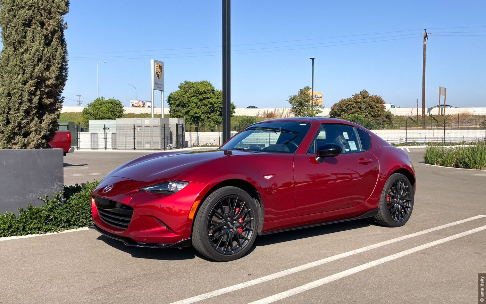
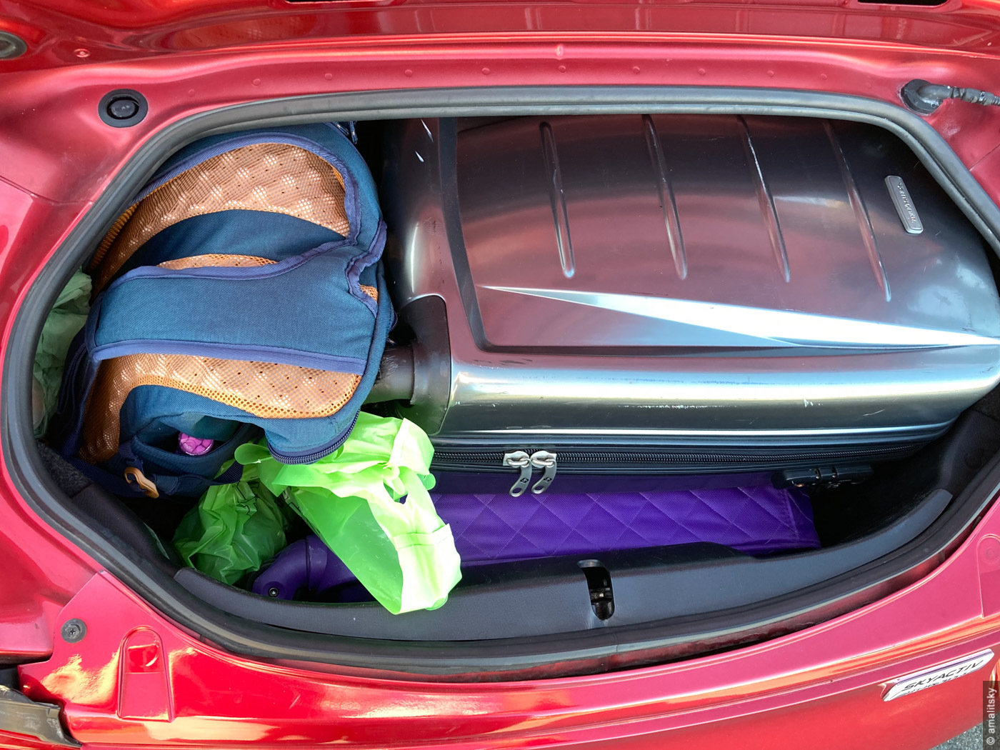
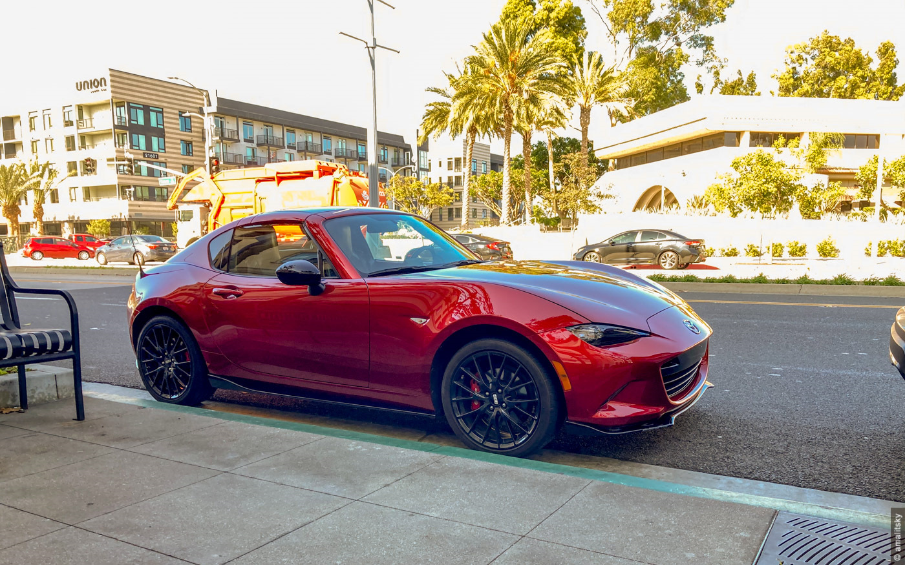

В конце прошлого года мы летали в <i>Los Angeles Porsche Experience Center</i> кататься на 718-ом Boxster. Но про этот двухчасовой опыт в следующих сериях.

Сегодня хочу рассказать про 2019 <i>Mazda MX5 RF</i> которую мы взяли на три дня в LA через <i>Turo</i>. Кажется, три дня с программой покатушек (проехали около 500 км) - минимальное время за которое я могу привыкнуть к автомобилю и понять большинство его corks & features.

Чтобы не тянуть - машина просто умопомрачительная - лёгкая, механическая, эмоциональная. Изначально она оглушает и немного пугает - всё происходит очень громко (до сих сомневаюсь - не сечёт ли на той машине глушитель). А пугает ощущением что всё слишком близко - дорога, другие автомобили и отбойники.

Закрываю глаза и слышу как орёт мотор крутящийся до семи с половиной тысяч оборотов, как дрожит на светофорах рычаг переключения передач, как обнимает тебя "кокпит" - изначально удивляешься как ты и твои 182-см туда поместились. Посадка практически лежачая - сидения стоят очень низко. Ты не садишься в неё, ты её надеваешь.

Каждое ускорение - праздник, каждый километр на спидометре заработан, слава богу, не кровью, а повышеным адреналином в крови, каждый поворот - рассказ в трёх частях. Торможения - не проблема - машина лёгкая, а тормоза - Brembo.

Лёгкий вес и коммуникативность опьяняют. Даже на хайвее где все едут 120 кмч мазда в отдельной категории - ей всё дается слишком легко! Моментально становится понятно что это очень простой и честный автомобиль. Может быть из 90-ых? И это комплимент.

Из минусов - жёсткость кузова и непригодность для путешествий в стиле Gran Tourismo - и места для багажа маловато и, скорее всего, переизбыток эмоций быстро принесёт усталость. При сложенном верхе телефон порядочно дрожит в креплении. Поэтому в основном ездили с закрытой крышей, но это скорее дело личных предпочтений.

MX5 это не GTI и не M2, но это не минус - это другая лига! Из-за арок видимых из-за руля и относительно мягкой подвески иногда кажется что ты не едешь, а паришь на лёгкомоторном самолёте. MX5 совсем не "утюжит" дорогу под собой.

Если нет возможности проехаться на машине, то можно просто открыть багажник и поиграться весом его алюминевой крышки - кажется, это отлично передаст философию всего автомобиля.

За эти дни три случайных прохожих сделали мазде комплимент. Ни разу со мной этого не случалось ни до ни после миаты. При том что Лос Анжелес очень избалован хорошими и просто дорогими автомобилями.

С такой машиной жизнь проще, полнее и по-хорошему веселее. Этакий витамин С. В этой японке плещется итальянская кровь.

<b>Unbelievably good!</b> It really is.
