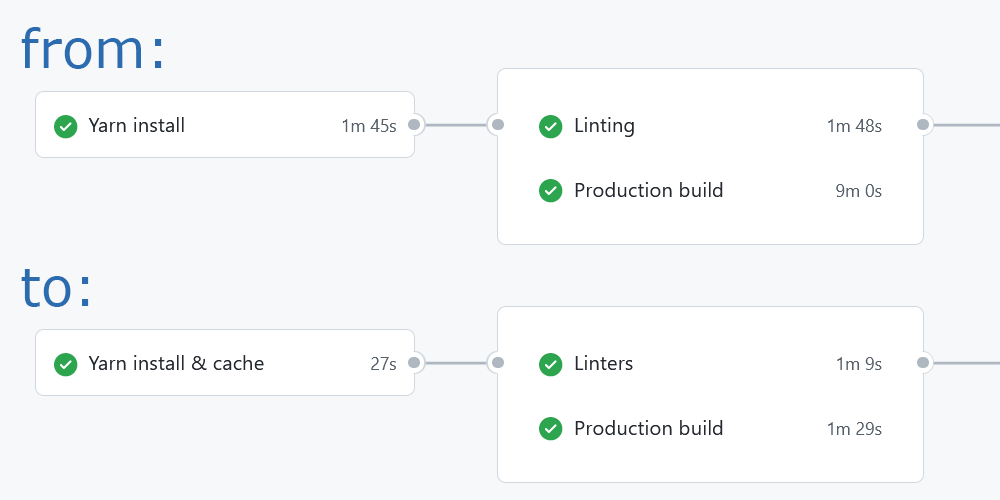

This blog is very new and quite empty (less than 20 pages) and yet I was experiencing
10 minutes long production builds on my local machine.
And GitHub actions (which execute the production build at some point) were taking
anywhere from 14 to 20 minutes.

Which is too long of a wait for a website preview deployed or pull requests verified.
I decided to figure out what can be optimized and ended up with 6 to 10 minutes
GitHub action runs.
In this post I'd like to share my learnings - hopefully it can help you to reduce caffeine
consumption while waiting for PR to get verified by linters or website to go live.



## GitHub Action Terms

First, few notes on GitHub action terms and debugging options. If you are familiar with
them feel free to head straight to [optimization techniques](#caching-node-modules).

_Workflow_ is the whole yaml file describing events triggering it and list of _jobs_ performed
once it is triggered.

Workflow _jobs_ run on different nodes (containers) in parallel, unless you explicitly define
relations between them with `job.needs` property.

Every _job_ contains a list of _steps_ which are executed on the _same_ node sequentially.

Because of the independent nature of _jobs_ execution, state of the working directory is
**not** shared between different jobs of a single workflow.
That's why pretty much every job starts with checking out the branch with
`uses: actions/checkout@v2` action.

### Debugging GitHub Actions

Even though verifying GitHub action workflow locally is not possible and working on it
requires trial-and-error iterations there is an `ACTIONS_RUNNER_DEBUG`
[environment flag](https://docs.github.com/en/actions/monitoring-and-troubleshooting-workflows/enabling-debug-logging)
which makes it a little easier and less frustrating.

In relation to caching debugging flag helps us to see what keys are used for the exact and/or
partial match and what kind of cache hit (if any) happened during the workflow run.

### Dependency Cache vs Artifacts

GitHub provides [two similar but distinct](https://docs.github.com/en/actions/advanced-guides/caching-dependencies-to-speed-up-workflows)
options for sharing files between workflows and workflow jobs: _artifacts_ and _dependency caching_.

_Artifacts_ are better suited for exporting something out of the CI pipe (i.e. to the external
logging or analytics system) and have more restrictive storage limits.
Also, artifacts are "scoped" by the workflow, while dependency cache is not.

We will be using dependency caching today since we don't need workflow scoping nor plan to
make our cache public and definitely can enjoy _10Gb_ of free storage we don't need to manage
in any way.

### GitHub Dependency Cache Branch Scope

By design _dependency cache_ is scoped within the branch originating the event triggering the
workflow. At the same time, workflows triggered of any branch have **read** access to the
caches of respective _base_ (when applicable) and _master_ branches.

This is important case you might see cache misses once PR is merged into the _master_ branch even
though minutes ago pull request update workflow had successfully built cache for it on the
_feature_ branch.

This is similar to variables scoping in programming languages where inner functions have access
to parent function and global scope variables but not the other way around.

### Dependency Cache Keys

Recommended `actions/cache` requires you to set the `key` for the **exact** cache hit.

Using the optional `restore-key` allows you to start with the older cache version
(whenever it makes sense) and then, after updating cache with your application logic
(i.e. `yarn install`), save it with the exact `key` you were looking for in the first place.

This approach works very well when storing npm package manager cache folder, _node_module_s and
also for incremental production builds of GatsbyJs.

Please note the while `key` field takes the whole string, `restore-keys` takes a list
of key **prefixes** and they are used as such during the cache matching process.
More on [cache key matching](https://docs.github.com/en/actions/advanced-guides/caching-dependencies-to-speed-up-workflows#matching-a-cache-key).

Last thing to note is that between multiple _partial_ matches for any given key _prefix_,
the newest cache record will be selected.

## Caching Node Modules

_Disclaimer: I'm using **yarn** 1.x as my package manager but similar optimization approaches
should be applicable to **npm**._

### Caching Package Manager Cache Folder

Recommended approach to caching npm dependencies is to cache package manager cache folder
(`~/.cache/yarn` or `~/.npm/_cacache`) rather than project's own _node_modules_ folder.
That implies executing `yarn install --prefer-offline` to get dependencies copied from
the local cache into the _node_modules_ folder whenever you need them.

I used this approach from the day one, and could see that even though dependencies
are indeed being copied from the local cache `yarn install` takes about a minute on
_every_ step of the workflow.

If your workflow has four _jobs_ and each of them requires _node_modules_ folder to operate,
four minutes will be spent on copying npm dependencies from one local folder to another.

Recommended [`actions/setup-node` action](https://github.com/actions/setup-node) is
using this approach along with lock-file hash as a `key`.

### Caching node_modules Folder

I tried caching _node_modules_ folder itself.
With that `yarn install` can be called only once - by the initial _setup_ job when exact
cache hit was not found.
All subsequent jobs (and even workflow runs) will restore exact _node_modules_ folder
from the dependency cache using the _exact_ key match.

Surprisingly restoring _node_modules_ from cache is _two_ times faster than copying files
from package manager cache and takes about 30 seconds (for every job).
**2 minutes saved right there!**

On the flip side - whenever lock-file gets updated `yarn install` seems to remove **all**
the content of _node_modules_ folder (if restored from the partial cache match) and download
all the dependencies (rather than just updated ones) over the network.

Basically for dependency update scenario caching _node_modules_ doesn't help at all.
At least not whith _yarn_ 1.x.
For me "regular" updates when `yarn.lock` doesn't change was a priority and that's what I was
optimizing for.

Here is the code snippet I'm using to set up the caching:
```yaml
- name: node_modules cache
  id: node-modules-cache
  uses: actions/cache@v2
  env:
    cache-name: node-modules-yarn
    cache-fingerprint: ${{ hashFiles('yarn.lock') }}
  with:
    path: node_modules
    key: ${{ runner.os }}-${{ env.cache-name }}-${{ env.cache-fingerprint }}
    restore-keys: ${{ runner.os }}-${{ env.cache-name }}

- name: Yarn install
  # called at most once for the workflow by the "setup" job
  if: steps.node-modules-cache.outputs.cache-hit != 'true'
  run: yarn install --prefer-offline --frozen-lockfile
```

### Caching Both: Node Modules and Yarn Cache

I've tried to optimize dependency update scenario by caching package manager cache along with
_node_modules_, but it didn't work.
Downloading and uploading lots of files from the folder actually made the `yarn install` process
slower than loading all the dependencies over the network!

You can check my [failed approach here](https://github.com/amalitsky/lab/pull/782/files).

## Incremental GatsbyJs Builds
Similar to _node_modules_ we can cache GatsbyJS production build artifacts.

I believe starting with version 3 _GatsbyJs_ supports incremental builds out of the box -
no configuration necessary.
The only requirement is to maintain `.cache` and `public` folders between builds.

GatsbyJs build script will invalidate and update these folders for us.
_Thanks, Gatsby team, this is pretty cool and very helpful!_

All we need to do is to configure caching for aforementioned folders:
```yaml
name: Cache production build
id: prod-build-cache
uses: actions/cache@v2
env:
  cache-name: prod-build
  cache-fingerprint: >-
    ${{ hashFiles('package.json','gatsby.config.ts','gatsby.node.ts','gatsby-ssr.tsx') }}-
    ${{ hashFiles('src/html.tsx','src/gatsby-hooks/*.*','src/page-templates/**/*.tsx') }}
with:
  path: |
    public
    .cache
  # save the build for this update (sha) so that we could deploy it in the next job
  key: ${{ runner.os }}-${{ env.cache-name }}-${{ env.cache-fingerprint }}-${{ github.sha }}
  restore-keys: |-
    ${{ runner.os }}-${{ env.cache-name }}-${{ env.cache-fingerprint }}-
    ${{ runner.os }}-${{ env.cache-name }}-
```

In my workflow _Production build_ and _Deploy_ are two separate (albeit sequential) jobs.
That's why I'm storing commit specific (`github.sha`) version of the production build.

To increase the cache key specificity (and with that - quality of the partial cache match)
I'm using `hashFiles` of GatsbyJS configuration files and application level components.
We could totally get away with just `${{ runner.os }}-${{ env.cache-name }}-${{ github.sha }}`.

On average **incremental builds reduced production build times from ten to three minutes**.
That's three to four times faster than it was!
With just ten lines of code and no need to dive deep into intricacies of Gatsby's build process.
Wow!

## Conclusion
Using dependency cache for GitHub actions is fairly straightforward and, even though not
without catches, can significantly reduce workflow running times with just a few lines of yaml.

For now, I'm very satisfied with results of this optimization as well as overall workflow run times.

Wishing you the same and please [let me know](https://twitter.com/amalitsky) if you have
any questions or comments.

## References
- [This website workflow](https://github.com/amalitsky/lab/blob/master/.github/workflows/pull_request.yml)
  using optimizations described
- [GitHub actions basics](https://docs.github.com/en/actions/learn-github-actions/understanding-github-actions#the-components-of-github-actions)
- [Exhaustive GitHub actions syntax](https://docs.github.com/en/actions/learn-github-actions/workflow-syntax-for-github-actions)
- [Improving GatsbyJs build performance](https://www.gatsbyjs.com/docs/how-to/performance/improving-build-performance/) on GatsbyJs docs
