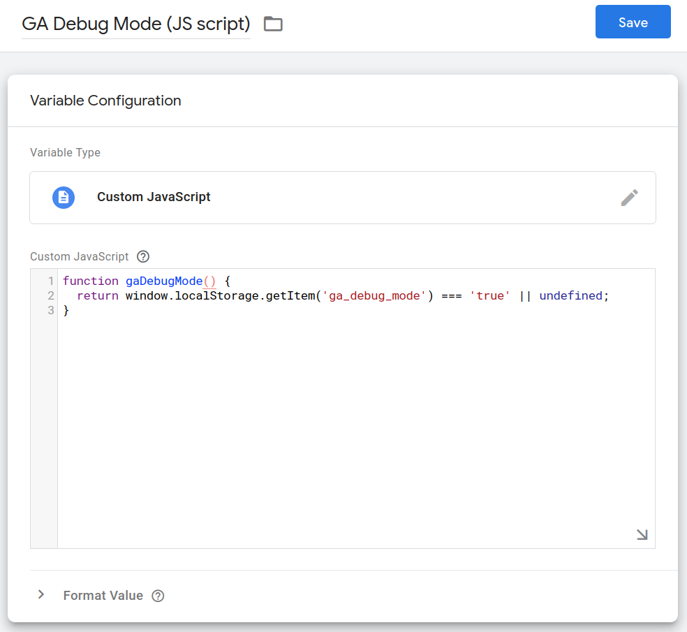
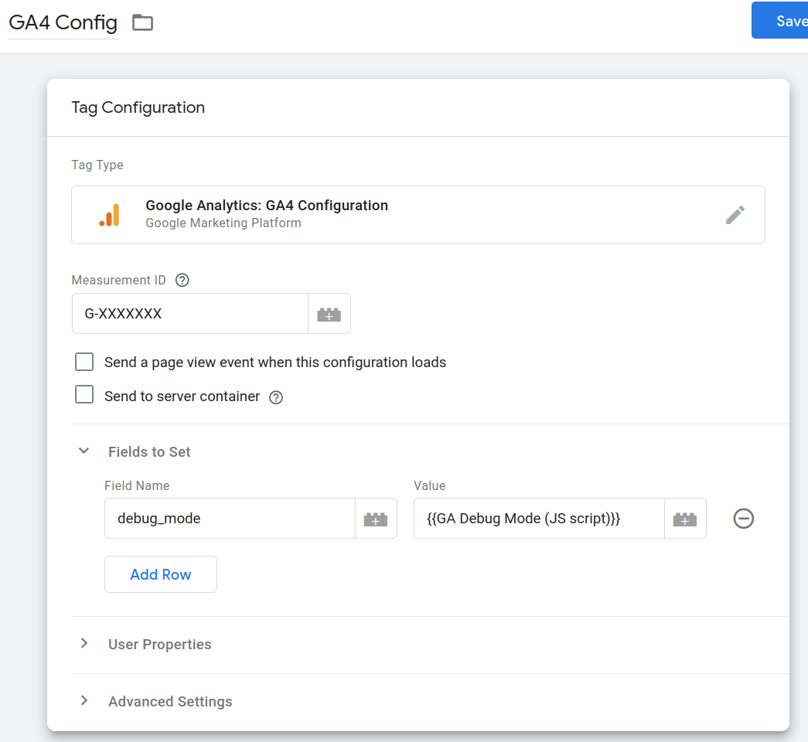
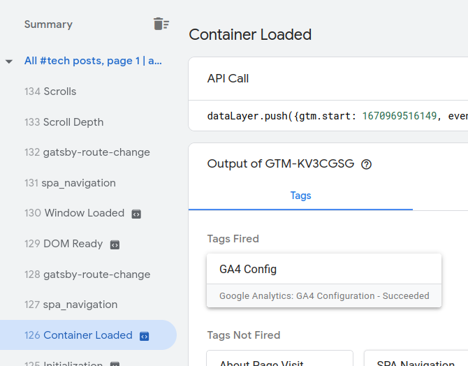
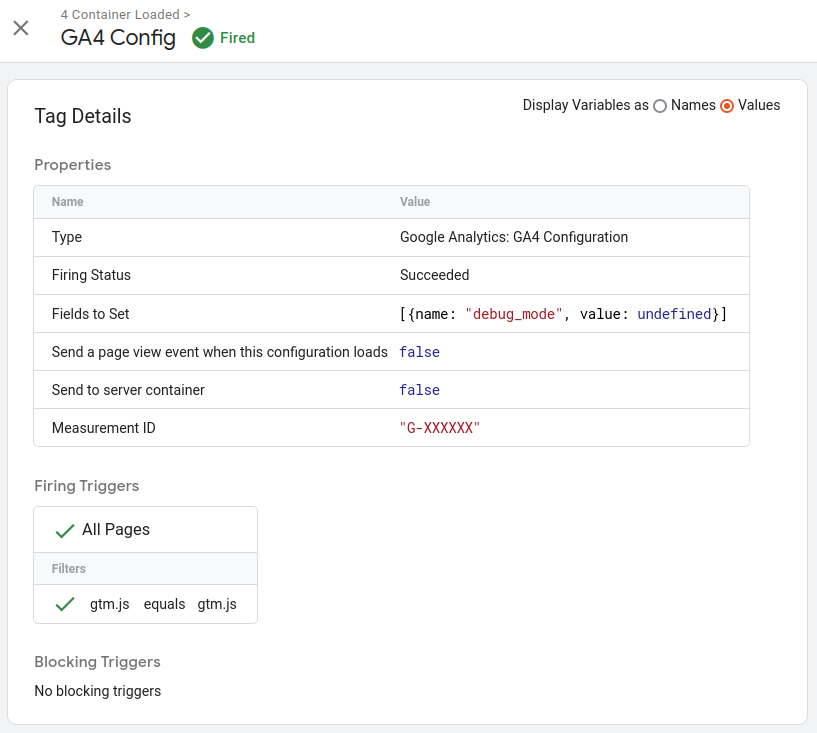
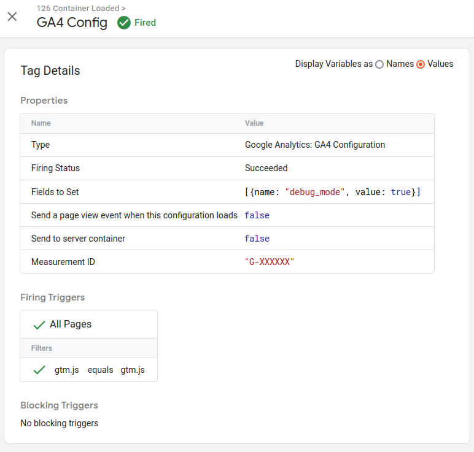
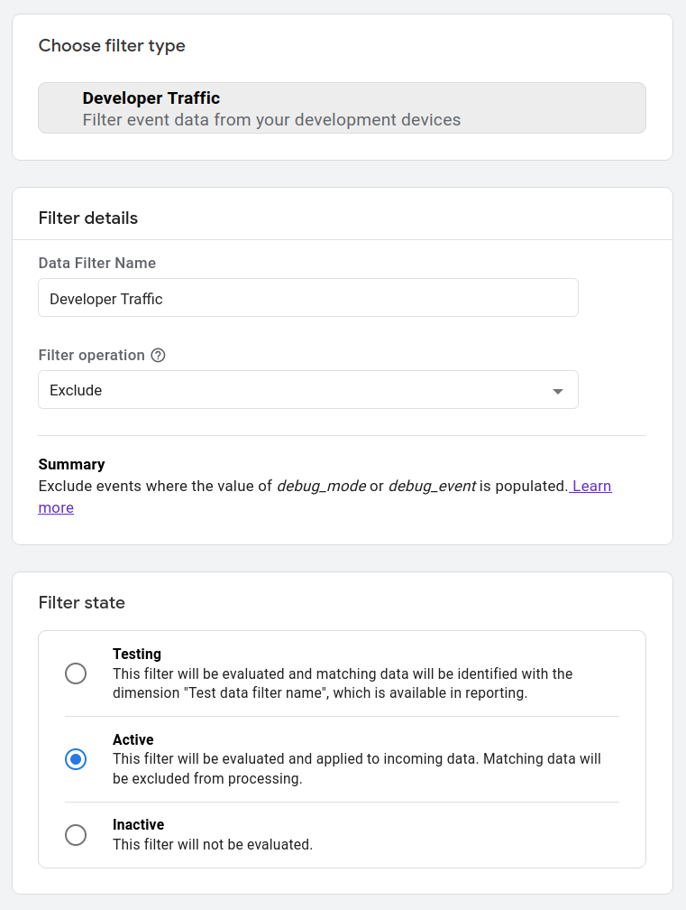

We collect website or webapp usage statistics in order to understand our users better
and make well-founded business, marketing and user experience decisions based on it.
Analyzing the usage data is a huge topic by itself, but no matter how sophisticated
our reports are, they work with the data we gathered.
If this data is incomplete, bloated or too noisy, quality of user analytics reports
decreases and affects our business and user experience decisions in a negative way.

Automated tests traffic is not representative of our real users.
Let's see how we can filter it out from Google Analytics (GA) data collection.

_[Enough talk, take me straight to the solution!](#playwright-storage-state-and-runtime-debug-mode)_

## Internal Traffic Filter Based on Client IP Address
Probably, this is the most obvious and also very simple solution - if you have a list of
_internal_ IP addresses to exclude (think HQ, remote developers and CI servers),
you can exclude all the traffic coming from them with the native
[Internal Traffic](https://support.google.com/analytics/answer/10108813#activate)
filter and
[Internal Traffic Definition](https://support.google.com/analytics/answer/10104470?hl=en&ref_topic=9751244)
available in Google Analytics Tag settings.

However, if your automation tests are running in the cloud, IP addresses of those virtual
machines are likely to change over time.
You will have to keep updating the list of _internal_ IP addresses manually to keep
the development and testing traffic out.

<Note>

  For example, GitHub provides an API endpoint to retrieve the
  [list of IP addresses used by GitHub action runners](https://docs.github.com/en/actions/using-github-hosted-runners/about-github-hosted-runners#ip-addresses) .

</Note>

It gets even more complicated with remote colleagues accessing your website
from various locations across the world while (hopefully) enjoying the comfort of their homes.

## Custom Product Build without Google Analytics
Second option is to introduce a special _testing_ build for your website or application,
which would has Google Analytics initialization script removed.

In modern web development usually we have two build _targets_ - production and development.
The new, _testing_ one, will be just like the production one but with small tweaks removing
(or disabling) the GA code.

Two problems arise:
1. We have to build and deploy that specific _testing_ build before running any of our automated
  tests.
  This is not always ideal - often we want to run tests against the regular _production_
  version of our website which might be already up and running.

2. Some automated tests are designed to run against the public production version
  of the product, were we simply can't deploy a custom build.

This method has its limitations but teams, already having a specialized
_testing_ build, can benefit from this approach the most.

### Set Google Analytics Debug Mode in GTAG Script
If you want to use the custom _testing_ build approach **and** are using the older
[Google Tag (GTAG) script](https://support.google.com/analytics/answer/9355662?hl=en)
on your website, then you can conditionally add a `debug_mode: true` parameter to
`config` event:

```js
const isTestingBuild = process.env.NODE_ENV === 'testing';

// have to pass undefined instead of false
gtag('config', 'G-XXXXXX', { debug_mode: isTestingBuild || undefined });
```

When set to `true`, debug mode will mark all GA events generated by that build
(regardless of where it is deployed and who is using it), as _developer traffic_ -
the same way events are marked when using the
_[Google Analytics DebugView](https://support.google.com/analytics/answer/7201382) mode_.

To exclude _developer traffic_ events from Google Analytics reports we need to
[update _Developer Traffic Filter_ settings](#filter-developer-traffic-from-google-analytics-reports).

## Debug Mode URL Query Param
Let's assume that we can not limit the pool of _internal_ IP addresses and
_custom-no-google-analytics_ build doesn't fit our testing workflow or the way
our product is built and deployed.

Is there anything else we can do with the test code and, perhaps, a few lines of _runtime_
product code?
So that our application or website could recognize that it is being used by the
automated test runner?
Regardless of the environment and client ip.

_Of course we can!_

We can add a custom query param to the URL of every page we are testing,
i.e.: _example.com/?ga_debug_mode=true_.
Then javascript code of our product will pick up the query param in runtime
and disable (or label as _debug_) all GA events created during such session.

Implementation is a little tricky however, since there is no Playwright
configuration field we could leverage to add our custom query param to every page
we test.

Updating every page URL in our tests manually doesn't sound particularly exciting not future-proof.
Also, we don't want to pollute the list of product URLs we have in our analytics data,
in case something doesn't go as planned.

There is a better way!

## Playwright `storageState` and Runtime Debug Mode
Instead of a URL query param, let's use the
_[storageState](https://playwright.dev/docs/api/class-testoptions#test-options-storage-state)_
option of config file to populate the _localStorage_ of the every browser instance
spun by the Playwright with the custom `ga_debug_mode` property:

```ts
import type { PlaywrightTestConfig } from '@playwright/test';

const storageState = {
  cookies: [],
  origins: [{
    origin: '*', // doesn't narrow hostname at all. Use with caution
    localStorage: [
      {
        name: 'ga_debug_mode', // feel free to modify the property name
        value: 'true', // this is a string
      },
    ],
  }],
};

const config: PlaywrightTestConfig = {
  use: {
    baseURL: 'https://example.com/',
    browserName: 'chromium',
    headless: true,
    storageState,
  },
};
```

<Note>
  <p>
    Please note that `ga_debug_mode` localStorage property value is a string,
    not a boolean.
    That's because all values stored in
    [localStorage](https://developer.mozilla.org/en-US/docs/Web/API/Window/localStorage)
    or
    [sessionStorage](https://developer.mozilla.org/en-US/docs/Web/API/Window/sessionStorage)
    have to be of a string type.
  </p>

  <p>
    localStorage is a persistent storage - if you add `ga_debug_mode`
    property in your browser's JavaScript console, the setting will stick.
    All subsequent sessions from that browser won't get reported to Google Analytics.

    This is not a problem for Playwright tests, since an
    [isolated browser context](https://playwright.dev/docs/test-fixtures#built-in-fixtures)
    is created for every test.
    After being created with an empty `localStorage` state, it will get supplemented with
    the value of `storageState.localStorage` config property.
  </p>

</Note>

Our website or application runtime code will check the `localStorage.getItem('ga_debug_mode')`
value during the _initialization_ phase and - when it is set to `'true'` - disable
Google Analytics completely or turn the GA _Debug Mode_ on (more on that below).

We need to turn the reporting off or mark all the future GA events with `debug_mode: true`
event parameter **before** Google Analytics (or GTM) initialization script runs.

<Note>

  Conceptually, _initialization_ phase is the javascript code running right
  before (or during) the first UI render:
  - in React, this is where the top most
    [`ReactDOM.render`](https://reactjs.org/docs/react-dom.html#render),
    [`ReactDOM.createRoot`](https://reactjs.org/docs/react-dom-client.html#createroot)
    or
    [`ReactDOM.hydrateRoot`](https://reactjs.org/docs/react-dom-client.html#hydrateroot)
    function is called
  - for GatsbyJs websites it is the
    [`clientRender`](https://www.gatsbyjs.com/docs/reference/config-files/gatsby-browser/#onClientEntry)
    method of the _gatsby-browser_ file
  - in angular application, there is a custom
    [`APP_INITIALIZER` token provider](https://angular.io/api/core/APP_INITIALIZER)
  - setting the listener for the
  [`DOMContentLoaded` document event](https://developer.mozilla.org/en-US/docs/Web/API/Document/DOMContentLoaded_event)
    is still legal
  - if your
    [CSP policy](https://developer.mozilla.org/en-US/docs/Web/HTTP/CSP)
    allows, you can add an inline `script` tag to the main HTML template file.
    Make sure that it is the first `script` to be executed when page is loaded.
    Check this
    [MDN article on `script` tag attributes](https://developer.mozilla.org/en-US/docs/Web/HTML/Element/script#attributes),
    such as `async` and `defer`.

</Note>

Now we will look into every option we have to disable GA in runtime, based on the way
Google Analytics is installed on your website (with or without the Google Tag Manager) and
preferred method of filtering out the developer traffic - by skipping GA code altogether
or marking user events with `debug_mode` parameter.

### Skip Google Analytics Initialization in Runtime
You can disable GA or GTM initialization code by wrapping its setup code snippet with the
following `if` statement:

```html
<script>
  if (window.localStorage.getItem('ga_debug_mode') !== 'true') {
    // GTM or GTAG Initialization code
  }
</script>
```

This way there will be no user events reported to Google Analytics engine at all
during that particular browsing (in fact - testing) session.

### Google Analytics Debug Mode with the Older GTAG Script
This GTAG only method is very similar to the snippet we used for the
_custom-no-google-analytics_ testing build.
The only difference is that `debug_mode` event parameter value is conditional and will be set in
runtime:

```js
const gaDebugMode = window.localStorage.getItem('ga_debug_mode') === 'true';

// have to pass undefined instead of false
gtag('config', 'G-XXXXXX', { debug_mode: gaDebugMode || undefined });
```

This way, when `ga_debug_mode: 'true'` is provided by Playwright, all GA events of the
testing session will get tagged with `debug_mode: true` event parameter, so that we could
[filter them out](#filter-developer-traffic-from-google-analytics-reports)
later with the native _Developer Traffic_ GA filter.

### Google Analytics Debug Mode with Google Tag Manager
When you use [Google Tag Manager](https://www.analyticsmania.com/post/gtag-vs-google-tag-manager/),
Google Analytics Config event is fired by GTM automatically and there is no GA
initialization javascript code we can tweak directly.

Instead, we will be adding a
[user-defined GTM variable](https://support.google.com/tagmanager/answer/7683362)
which retrieves the `ga_debug_mode` value from browser localStorage and passes
it to the [GA4 Config Tag](https://support.google.com/tagmanager/answer/9442095?hl=en#step-1)
as a _Tag Field_ when instantiating Google Analytics on your website.

Lets
[create a user-defined _Custom JavaScript_ GTM variable](https://support.google.com/tagmanager/answer/7683362#custom_javascript)
named _GA Debug Mode (JS script)_ with this snippet:

```js
function gaDebugMode() {
  return window.localStorage.getItem('ga_debug_mode') === 'true' || undefined;
}
```

And here the screenshot of variable configuration:


<Note type = 'warning'>
  When Debug Mode localStorage property is not set, we deliberately return `undefined`
  instead of `false`, because `false` gets converted to a string and
  [is treated by Google Analytics engine as a valid debugging flag](https://support.google.com/analytics/answer/7201382?hl=en#enable&zippy=%2Cgoogle-tag-manager-websites):

  > To disable debug mode, exclude the `debug_mode` field; setting the field to false doesn't disable debug mode.
</Note>

<Note>
  Another type of user-defined GTM variable we can use is the
  _[JavaScript Variable](https://support.google.com/tagmanager/answer/7683362#javascript_variable)_.
  It allows GTM to read the value of a global `window` property (i.e. `window.gaDebugMode`)
  set by our product code in runtime.

  This way the logic of retrieving `ga_debug_mode` value from the localStorage remains in
  the product code.
</Note>

Next, we need to add a new `debug_mode` _Tag Field_ to our GA4 Config Tag.
Let's select our _GA Debug Mode (JS script)_ variable as it's value:


<Note>

  While `ga_debug_mode` variable name we used in Playwright config,
  localStorage and our product/website runtime code is custom and can be changed,
  `debug_mode` field name for the GA4 Config tag is predefined and we have to stick with it.

</Note>

At this point Google Tag Manager should be passing the `debug_mode` field read from browser's
localStorage when initializing Google Analytics code in the browser.
All subsequent user (or, in our case, test) generated GA events will get marked
with `debug_mode: true` event parameter, so that we could
[filter them out](#filter-developer-traffic-from-google-analytics-reports)
later.

To validate that it works as expected, go to the
[GTM Preview Mode](https://support.google.com/tagmanager/answer/6107056?hl=en)
and open you website (remote or local).
Then, click on the _Container Loaded_ event in the left column.
You should see the _GA4 Config_ card in _Tags Fired_ group:


Click it to open the _Tag Details_ panel and select _Values_ radio button in the top right corner.

This is how it looks in my setup with debug mode turned off:



Now, open the DevTools JS console in browser with an active GTM debuging session and
run the following command to emulate localStorage value populated by Playwright test runner:
```js
localStorage.setItem('ga_debug_mode', 'true');
```

Reload the page, and open _GA Config_ card details panel.
This is how it should look now:

Note that value for the `debug_mode` field is `true`.

If everything look fine, don't forget to remove the remove `ga_debug_mode` property
from the localStorage of your browser with the following one-liner:
```js
localStorage.clearItem('ga_debug_mode');
```

## Filter Developer Traffic from Google Analytics Reports
Now, when all GA events created by automated testing runs are marked with `debug_mode: true`
flag, we can easily filter them out from the GA data collection.

To do so we need to _active_ the native _Developer Traffic_ filter in Google Analytics.
Head to the _Admin > Property Settings > Data Settings > Data Filters_.

By default, the _Developer Traffic_ filter mode is _Testing_ which doesn't drop
debug/developer traffic GA events, but marks them with _Test data filter name_ dimension,
so that you could
[confirm that it works as expected](https://www.analyticsmania.com/post/how-to-exclude-internal-traffic-in-google-analytics-4/#test-the-filters1)
before permanently removing them from the incoming data stream.



## Conclusion

To avoid polluting Google Analytics data with test run events we need to:
1. make our product code aware of the fact that it is being used by automated test runner.
   We have two options - having a separate _testing_ build target, or
   passing a _flag_ to the website javascript runtime code.
2. use the flag passed (or custom build) to
   [turn the analytics off](#skip-google-analytics-initialization-in-runtime),
   or tag all subsequent GA events with `debug_mode` flag and
   [filter them out](#filter-developer-traffic-from-google-analytics-reports)
   with the _Developer Traffic_ GA filter.

We went through three approaches to pass a testing flag to the product code:
1. [custom build target for testing](#custom-product-build-without-google-analytics)
2. [debug_mode query param](#debug-mode-url-query-param) for the URL being tested
3. [ga_debug_mode localStorage property](#google-analytics-debug-mode-with-google-tag-manager)
   populated by the Playwright test runner

We also looked into the differences of turning _Debug Mode_ on
for the
[older GTAG script](#google-analytics-debug-mode-with-the-older-gtag-script)
and
[Google Analytics set up by the Google Tag Manager](#google-analytics-debug-mode-with-google-tag-manager).

Thanks for reading so far (way too long, I know) and Happy scripting!
