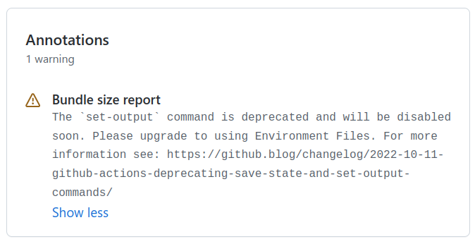

For this website I use a github action posting an
[application snapshot report](https://github.com/amalitsky/lab/commit/9d7afa65f48941964aff80152886c664e5713673#comments)
as a pull request comment.

Recently this warning started to appear in GitHub workflow run summary view:



> The `set-output` command is **deprecated** and will be disabled soon.
> Please upgrade to using Environment Files.

I went off to investigate it and not only successfully migrated `set-output`
to the recommended `$GITHUB_OUTPUT` solution, but also was able to replace somewhat
convoluted pull request commenting approach with a much simpler
_[Job Summary](https://docs.github.com/en/actions/using-workflows/workflow-commands-for-github-actions#adding-a-job-summary)_
feature
[recently introduced by GitHub Actions team](https://github.blog/2022-05-09-supercharging-github-actions-with-job-summaries/).

### GitHub Action Job Using Now Deprecated `set-output` Approach

Below is the original workflow job code which reads some text file into `outputs.report` variable
and posts it as a pull request commit comment.
This version was causing the warning above.

First step of the job:
 - reads `env.report_filename` file content into the local (bash) `report` variable
 - replaces new line symbols with
   [special symbols](https://github.com/orgs/community/discussions/26288#discussioncomment-3251220)
   to be handled properly when read back
 - uses now deprecated `::set-output` to pass the local (bash) `report` variable
   into the running [`step.outputs.report`](https://docs.github.com/en/actions/using-workflows/workflow-syntax-for-github-actions#example-using-output-as-url)
   variable so that subsequent steps of the same job have access to it

Second step uses
[`peter-evans/commit-comment@v2`](https://github.com/peter-evans/commit-comment)
action to post _multiline_ content from `outputs.report` variable as
a pull request commit comment on a GitHub page.

```yml
- id: read-report-file-into-output
  name: Read Report File into Output Variable
  run: |
    report=$(cat ${{ env.report_filename }})
    report="${report//'%'/'%25'}"
    report="${report//$'\n'/'%0A'}"
    report="${report//$'\r'/'%0D'}"
    echo ::set-output name=report::$report

- id: post-report-as-pr-comment
  name: Post Report as Pull Request Comment
  uses: peter-evans/commit-comment@v2
  with:
    body: "```\n${{ steps.read-report-file-into-output.outputs.report }}\n```"
```

Note that `id` of the first step is used by the second step to access `outputs.report` variable.

<Note>

  There is also
  [`peter-evans/create-or-update-comment@v2`](https://github.com/peter-evans/create-or-update-comment)
  action which posts comment to the _Pull Request_ page rather than particular _commit_
  belonging to that PR.
  That's the one I should have used. Below we will see why I won't need neither of the two.

</Note>

### Migration from `set-output` to `$GITHUB_OUTPUT`
Now `$GITHUB_OUTPUT` and `$GITHUB_STATE` environment variables
[are provided as a replacement](https://github.blog/changelog/2022-10-11-github-actions-deprecating-save-state-and-set-output-commands/#examples)
for deprecated `set-output` and `set-state` commands.

New `echo "{name}={value}" >> $GITHUB_OUTPUT` syntax is quite simple and straightforward to use.
It is consistent between all
_[Environment files](https://docs.github.com/en/actions/using-workflows/workflow-commands-for-github-actions#environment-files)_,
meaning you can set _environment_, _state_ and _output_ variables using the same syntax.

In fact it is very similar to the one used in bash/linux terminal for
[redirecting command output to files](https://askubuntu.com/questions/420981/how-do-i-save-terminal-output-to-a-file#answer-420983).
Just that instead of arbitrary strings we are redirecting _key&value_ pairs.

The only complication comes when we need to pass _multiline_ text as an environment variable value.
Instead of somewhat magical special symbols we used in the snippet above, there is a
[new and well documented approach](https://docs.github.com/en/actions/using-workflows/workflow-commands-for-github-actions#multiline-strings):
```yml
- name: Set Multiline Value as Env Variable
  run: |
    echo '{name}<<{delimiter}' >> $GITHUB_ENV
    echo '{value}' >> $GITHUB_ENV
    echo '{delimiter}' >> $GITHUB_ENV
```
Where `name` is the name of environment/state/output value we want to define, i.e. "`report`",
`delimeter` is a randomly generated string (below we will see how to do that) and `value` is
the actual multiline content we want to store.

Here is the updated yaml using `$GITHUB_OUTPUT` environment file:

```yml
- id: read-report-file-into-output
  name: Read Report File into Output Variable
  run: |
    delimiter="$(openssl rand -hex 8)"
    echo "report<<${delimiter}" >> $GITHUB_OUTPUT
    cat ${{ env.report_filename }} >> $GITHUB_OUTPUT
    echo "${delimiter}" >> $GITHUB_OUTPUT

- id: post-report-as-pr-comment
  name: Post report as Pull Request Comment
  uses: peter-evans/commit-comment@v2
  with:
    body: "```\n${{ steps.read-report-file-into-output.outputs.report }}\n```"
```

`openssl rand -hex 8` command generates a unique string for the `delimeter` value.
We have to have it randomly generated to protect ourselves from code injection,
which, apparently, is harder to implement when your new line symbol is unpredictable.

Congratulations, **that's pretty much it!** - we have updated our workflow with the new syntax,
and that pesky warning won't appear on our workflow run summary pages.

### Replacing Pull Request Comment with `$GITHUB_STEP_SUMMARY`

While at it I also noticed a new
_[Job Summary](https://docs.github.com/en/actions/using-workflows/workflow-commands-for-github-actions#adding-a-job-summary)_
concept, which allows to render arbitrary workflow step _summaries_ (in markdown)
on a workflow run page.

I decided to use the new summary approach instead of PR comment, since it allows
to remove the third party `peter-evans/commit-comment@v2` action
and downgrade `GITHUB_TOKEN` permissions for jobs run by Dependabot pull requests.
_Previously I had to have `permissions.contents: write` set for the job responsible for
posting a comment._

It also means that I have an easier and more scalable way to print various reports
and logs from my workflows, and I plan to extend its usage in the future.

Here is the end result which works beautifully **and** is simpler than the one I started with:

```yml
- id: pass-report-into-summary
  name: Pass Report into the Summary
  run: |
    echo "### My Report Header" >> $GITHUB_STEP_SUMMARY
    echo "\`\`\`" >> $GITHUB_STEP_SUMMARY
    cat ${{ env.report_filename }} >> $GITHUB_STEP_SUMMARY
    echo "" >> $GITHUB_STEP_SUMMARY
    echo "\`\`\`" >> $GITHUB_STEP_SUMMARY
```

We "route" all the output we want to be rendered as a summary to
the `$GITHUB_STEP_SUMMARY` environment file - line by line.

Such output is supposed to be a valid markdown, and that's why I'm using code block
wrapper for the free formatted content of my report file.
We also have to escape backticks to be handled properly in the terminal or use
the alternative `~~~` syntax.

[Here you can see how the actual summary looks](https://github.com/amalitsky/lab/actions/runs/3453177813/attempts/1#summary-9454293532)
_in the wild_ &mdash; on a GitHub Actions workflow run page.

_And that's all for today, happy coding!_
