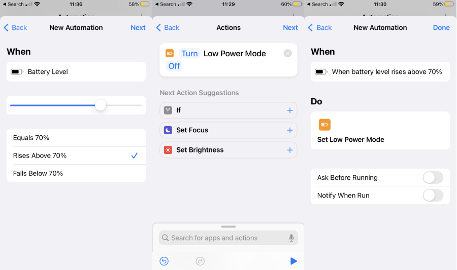
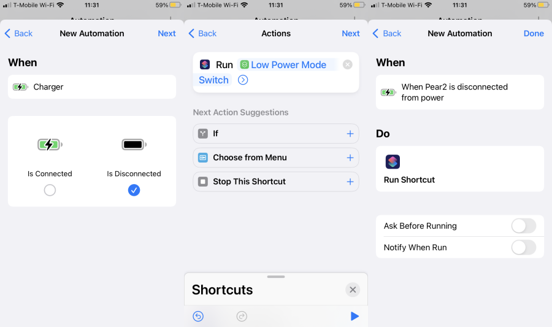

Recently we have spent a fabulous week in New York City doing the usual touristic stuff.
Central Park, MOMA, Guggenheim, Brooklyn Heights Promenade and four hour long bike rides -
to name a few.

It was going very well (albeit a bit tiresome) until our phones started to ran out of
juice long before the end of the day.
We didn't have power banks (I know, right) and navigating the Big Apple without
phones proved to be harder than we wanted.

I did notice however, that before the inevitable black screen of denial showed up,
my phone went into that somewhat mysterious _Low Power Mode_, denoted by the yellow battery symbol.
By default, it happens when battery charge crosses 20 percent and, subjectively,
the remaining 20 last almost as long as the first 80.

That got me thinking of almost perpetual _low power mode_ for my phone.
Apparently that's simpler than it sounds, and being able to use your phone for
something besides doom scrolling felt pretty good.
Curious? Read along!

## iPhone Low Power Mode

Iphone [Low Power Mode](https://support.apple.com/en-us/HT205234) goal is to reduce battery
consumption, and it is done by:
- reducing display brightness, refresh rate and shortening the lock out period to 30 seconds
- turning off most background application updates including iCloud photos sync
- turning 5G off (good to know that 5G is actually a thing)

As mentioned above, it turns on automatically when charge goes below 20% and turns off once
battery level crosses 80% in an opposite direction.

You can always turn it on manually through _Settings > Battery > Low Power Mode_.
However, even in this case it will turn off once phone battery is charged up to 80%.

So, instead of turning it on manually every morning I want to write the _shortcut_
(iOS script) which turns _low power mode_ every time my battery charge level drops
below 70% and switches it off once change level goes above 70.
Honestly, 70 is somewhat arbitrary number, and you can choose whatever fits best your usage
pattern.

I also use my phone for navigation and music streaming when driving,
hence I'd like to turn _low power mode_ off while it is charging (plugged in)
regardless of the battery level.

So, let's do some scripting with an amazing and little-known
[Shortcuts iOS app](https://support.apple.com/guide/shortcuts/intro-to-shortcuts-apdf22b0444c/ios).
It's an Apple app, so chances are it is already installed on your phone.

## Custom Shortcuts

### Low Power Mode Check

First let's create a _shortcut_ to check if battery level is above or below the threshold.
It won't turn _low power mode_ on or off but will return `1` when we want _low power_ be
active and `0` when not.
It *doesn't* take charging state into account because I couldn't find the
_magic variable_ (shortcuts term) to read it from.
We will work around this issue later.

Click the plus icon in the top right corner of the screen.
I suggest to use something like _Low Power Mode Check_ as name of the shortcut.

We need to add two actions: _Get battery level_ and _if_ condition.
_Get battery level_ doesn't have any options and for _If...Otherwise...End if_
we need to choose _is less then or equal_ condition followed by our threshold
value (`70` in my case).

Now let's add _Number_ action and drag into _if_ block and provide `1` as number value.
Let's add another _Number_ action to the _Otherwise_ block and use `0` as its value.

This is how our first shortcut script should look like:

You can confirm the output by clicking Play button in the right bottom corner.
Script should print `1` or `0` based on the level of battery charge.

### Low Power Mode Switch

Now, let's create our second shortcut which will be turning _low power mode_ on or off
based on the result of _Low Power Mode Check_ shortcut.
Let's call this one _Low Power Mode Switch_.

First action here will be to run _Low Power Mode Check_ shortcut we've created earlier
(action to add is called _Run Shortcut_).
Select _Low Power Mode Check_ from the list and leave the _condition_ field empty.

Now let's add `If...Otherwise...End If` action and two iOS native _Set Low Power Mode_ actions.
The first one goes under the `If` block with _turn on_ option.
Second one goes under `Otherwise` with _turn off_.

Tap Play button at the bottom ot the screen and allow this shortcut to execute other Shortcuts
in the popup dialog.

Our _Low Power Mode Switch_ shortcut should look like this:

Perfect, now we can turn _Low Power Mode_ on and off based on the battery level
with our _Switch_ shortcut.
We never have to run _Check_ shortcut directly since it is meant to be used by _Switch_ action
only.

## iPhone Shortcut Automations

Shortcut, however, is just a iOS script to run various
(potentially multiple and based on some conditions) actions on your iphone or ipad with one tap
or Siri voice command.
It **won't** get executed automatically or based on some condition (like battery level) or schedule.

Unless, of course, we create an _Automation_ which does exactly that.
_Automation_ is the second tab in the _Shortcuts_ app.

_Automations_ allow to run various actions (including our custom _Shortcuts_)
on the phone based on various conditions.
List of conditions is provided by iOS.

We want our phone to:
- turn _Lower Power Mode_ **on** when battery level falls below 70%
- turn _Lower Power Mode_ **off** when battery level rises above 70%
- turn _Lower Power Mode_ **off** when charger is connected
- turn _Lower Power Mode_ **on or off** based on the battery level when charger is disconnected

Let's go ahead and create an automation for every scenario we've got'.

We start with _Plus button on Automations screen > Create Personal Automation > Battery Level_,
then select `70` with the slider and _Falls Below_ option.
Next we add _Set Low Power Mode_ action with _On_ option.

Here is the list of steps to create our first automation:

Let's create one more to turn _Low Power Mode_ off when battery charge goes above `70`:

Third one to run when phone charger is connected:

And the last one to be run when phone charger is disconnected:

This one is a little different because we run our _Low Power Switch_ shortcut,
which will do the right thing based on the current battery level.
You will need to allow this last automation to run our custom _Low Power Mode Switch_
shortcut in a security popup dialog.

I always turn _Ask before running_ and _Notify when run_ nobs off but do what you please.
In fact having notifications might help you to debug any shortcut or automation issues in
case if you experience any.

That's what the resulting list of our automations should look like:

And we are done!
Automations will run every time we might want to flip our _low power mode_ switch,
and we can enjoy significantly longer battery life.

<Note>
  Probably you have noticed that we had to hardcode our 70% threshold in three different places:
  _Low Power Check_ shortcut (were it belongs) and two automation triggers.
  I couldn't find a way to avoid it.
  We also have to use 5% increments for the threshold due to the way _Battery Level_
  automation trigger is defined.
</Note>

## Conclusion
We've created two _shortcuts_ and four _automations_ and got our phones to run
much longer on the same battery charge.

I'd call it a win!

If you don't care about _Low Power Mode_ being turned off when the charger
is connected, you can probably get away with two automations only and no shortcuts at all.
Personally I haven't tried it. Let me know.
