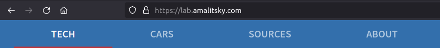
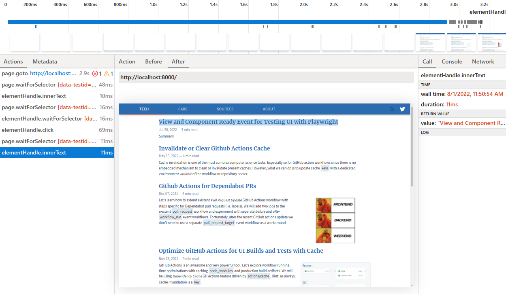

While testing this blog with the awesome [Playwright](https://playwright.dev/) I faced
the problem of tests failing on CI server (_github actions_ environment).
After some trial-and-error and a bit of investigation I figured that all tests failing
were initiating (or dependent on) partial application re-rendering or react rehydration.

Here I'd like to share my learning starting with the failing test and debugging
process towards the reliable and universal approach to handling single page app
navigation events in Playwright tests.

### The Goal



The test we will use as an example is the navigation bar (website header) test.
We click a link there and confirm that navigation happened and target page showed up.
Focus of the test is not to verify particular target page but to confirm that
navigation bar links work as expected.

Locally the test was failing every other time so to increase the failure
rate I turned the
[devTools network throttling](https://vanilla.aslushnikov.com/?Network.emulateNetworkConditions)
on:

```typescript
const cdpSession = await page.context().newCDPSession(page);

await cdpSession.send('Network.enable');

await cdpSession.send(
  'Network.emulateNetworkConditions', {
    downloadThroughput: 1000 * 1000, // 1Mb/s
    uploadThroughput: 512 * 1000,
    latency: 150,
    offline: false,
  },
);
```

Here is the test I started with:
```typescript
await page.goto('https://lab.amalitsky.com');

// select the first post header
await page.waitForSelector('[data-testid=PostPreview-Header]');

// verify the header text
await expect(postHeader.innerText()).resolves.toContain('View and Component');
```

Here we open the home page with the list of _Tech_ related posts and
verify that the _first_ post present on the page has the expected header.

<Note>

This is __not__ the most robust or intelligent approach for testing pages.
We will use it for now for the sake of simplicity.

There is no `expect` statement in the test because the test will fail by timeout
in case if post header was not found in time.

</Note>

[`ElementHandle.waitForSelector`](https://playwright.dev/docs/next/api/class-elementhandle#element-handle-query-selector)
method has the [auto-waiting](https://playwright.dev/docs/actionability) functionality
built into it.
This is important because even when the page takes time to load and render our
selector will patiently wait for the element to appear and become actionable.
Default timeout is `30` seconds, I reduced it to `10` for all of my tests.

Now after we verified that we start testing on the home page, let's proceed with the
actual navigation bar test.

We find the bar, click _Cars_ link and validate the target _Cars_ page after navigation.
_Cars_ page displays a different list of posts but structurally is the same as the home
page with _Tech_ posts.

```typescript
await page.goto('https://lab.amalitsky.com');

const techPostHeader = await page.waitForSelector('[data-testid=PostPreview-Header]');

await expect(techPostHeader.innerText()).resolves.toContain('View and Component');

const navBar = await page.waitForSelector('[data-testid=Header]');

const carsPageLink = await navBar.waitForSelector('[data-testid*=HeaderTabs-Tab_cars]');

await carsPageLink.click();

const carsPostHeader = await page.waitForSelector('[data-testid=PostPreview-Header]');

await expect(carsPostHeader.innerText()).resolves.toContain('Audi B8');
```

The last assertion fails - it expects post header containing _Audi B8_ present on _Cars_ page
but receives the first _home_ page post header instead.

**Why is that?**

### Debugging

If we open captured [playwright test trace](https://playwright.dev/docs/trace-viewer)
we will see that the last assertion is run on the _home_ page rather than on _Cars_ page
we were expecting.



<Note>

My go-to Playwright debugging approach with `slowMo: 350` and `show: true` doesn't
work here because the root cause of the issue we are trying to pinpoint is race condition.
Slowing the test down prevents it from happening.

[Playwright Inspector](https://playwright.dev/docs/debug) can't be used here for the same reason.

</Note>

_Cars_ link is present in the navigation bar, is clickable and works every time in
any environment when tested manually.
It also uses the native _Link_ component of the _gatsbyJs_ library hence it is
unlikely to be an implementation issue.

[Documentation on `elementHandle.click`](https://playwright.dev/docs/api/class-elementhandle#element-handle-click)
method states that it will _wait for initiated navigations to either succeed or fail,
unless `noWaitAfter` option is set_.

But for some reason even though we `await` for the `click` method call to succeed,
our assertion is executed too early while browser is still rendering the _home_ page!

_I guess_ from the browser (and subsequently, Playwright's) single page application
navigation is _not_ considered a _browser-native navigation_ event hence it can't
tell when it started or succeeded.

Also check [this comment](https://github.com/microsoft/playwright/issues/2078)
from the Playwright's contributor Dmitry Gozman where he is saying that Playwright waits
only for "_the navigation to be confirmed_" and none of `load`/`DOMContentLoadeded` events.

<Note>

I've experienced similar problem when my other test was typing in a value into the `input`
form element value _before_ react got a chance to hook up to it during SSR page re-hydration.
In that case there was no `click` method call to `await` for.

[`page.goto`](https://playwright.dev/docs/api/class-page#page-goto) method
supports `waitUntil` option with a list of strategies to delay further code execution.

However, generally speaking, none of them is adequate for a single page
(react, vue, angular, etc) application.
They can't guarantee that application is fully loaded, rendered and interactive.

Same limitation applies to
[`page.waitForNavigation`](https://playwright.dev/docs/navigations#asynchronous-navigation)
method.

</Note>

### _Native_ Solution with Page Specific Selectors
The most obvious (and as obviously wrong) solution would be to wait for certain time
and expect page transition and UI rendering to happen within that timeframe.
Had to mention this option just so that I could formally knock it out.

The better and fairly common solution is to wait for some target page element to appear.
Idea is that if some unique element has appeared it means that new application route got
rendered, and we can proceed with our tests.

From implementation perspective this sounds pretty verbose since potentially
we need to have some unique elements and selectors for every _from-to_ page tuple.

Besides, using page content to verify successful navigation sounds like a
leaking abstraction - state transition is an abstract event and doesn't really
depend on from-to pages elements.
I.e. in HTTP protocol using the HTTP response _code_ is usually sufficient to understand
if the request had failed or succeeded.
We don't have to parse the HTTP response _body_ to understand it.

If we update our selectors to be a little more specific our navbar test will never
fail because of pending navigation and premature test execution.

```typescript
await page.goto('https://lab.amalitsky.com');

// insted of selecting any post header we target very specific one with :has-test
// it also allows us to drop an extra assertion for the text itself
await page.waitForSelector('[data-testid=PostPreview-Header]:has-text("How to Wait")');

const navBar = await page.waitForSelector('[data-testid=Header]');

const carsPageLink = await navBar.waitForSelector('[data-testid*=HeaderTabs-Tab_cars]');

// initiating navigation
await carsPageLink.click();

// at this point we still might be on the home page
// but playwright will wait for the particular header to appear
await page.waitForSelector('[data-testid=PostPreview-Header]:has-text("Audi B8")');
```

This approach is reliable - our selectors are specific enough so that they don't overlap
on different pages.
If navigation happens within `10` seconds the test will find and match the expected element
on the navigation target page.

It isn't as helpful when working around re-hydration delay since usually
DOM tree structure doesn't change during re-hydration.
There will be no new elements to wait for in order to capture the _UI is ready_ state.
Probably, you still can make it work with the addition of custom class or `data-test-id`
attribute during re-hydration on a client.

<Note>

Playwright v1.14 introduced [Locators](https://playwright.dev/docs/api/class-page#page-locator)
which allow to capture and store ways to find and filter elements rather than `ElementHandle`
references.
That prevents whole class of errors caused by potentially stale references by executing
filters lazily in [web-first assertions](https://playwright.dev/docs/release-notes#-web-first-assertions).

For our scenario they don't make much of a difference.
Unless, again, we come up with very specific non-overlapping selectors.

</Note>

### React Router Location Change Event

Most single-page-applications use client-side router for seamless navigation
between application routes.
Such router navigations don't cause full page reload but update the view and
[browser's history](https://developer.mozilla.org/en-US/docs/Web/API/History_API).

<Note>

This blog uses React and [ReachRouter](https://github.com/reach/router)
and I'll be using them in code snippets below.

Implementation details for other frameworks and routers will differ but
conceptually the approach remains the same.

</Note>

Client side routers also provide methods to work with application route programmatically.
In particular, they are able to announce (or otherwise communicate) application route
change event via service method, react hook, or custom event.

Let's leverage the route change event to capture the successful single-page
application navigation without the need to wait for certain page element to
appear or disappear.

For this react driven website I'm using
[`useLocation`](https://reach.tech/router/api/useLocation) router hook wrapped in
[`useEffect`](https://reactjs.org/docs/hooks-effect.html) react hook.

That combo gives me the custom `useLocationChangeEvent` hook emitting specific
[CustomEvent](https://developer.mozilla.org/en-US/docs/Web/API/CustomEvent/CustomEvent)
on `window` object whenever application route changes:

```typescript
import React, {
  useEffect,
} from 'react';

import { useLocation } from '@reach/router';

function useLocationChangeEvent(): void {
  const location = useLocation();

  useEffect(() => {
    if (window) {
      // custom event type provides location details as a payload
      const event = new CustomEvent('REACT_ROUTER_PAGE_CHANGE_EVENT', { detail: { location } });

      window.dispatchEvent(event);
    }
  }, [location]);
}
```

<Note>

If there is more than one application navigation "event" provided by your router
(i.e. before navigation, during it and after it has completed)
pick the one which comes _after_ target page rendering has completed (or started).

</Note>

Now we need to capture `REACT_ROUTER_PAGE_CHANGE_EVENT` event in the Playwright test.
So that once received we consider the application route changed
and new page being ready for running subsequent tests.

For that we will use [`page.evaluate`](https://playwright.dev/docs/api/class-page#page-evaluate)
which allows us to wait for the `window` event in the _browser context_
and resolve a promise in our _test script environment_ once it was captured.

Basically we are building a bridge between react router `useLocation` hook and
promise we can `await` for in the test.

Here is the wrapper implementation:
```typescript
function waitForSpaNavigation(): Promise<string> {
  return new Promise((resolve, reject) => {
    let resolved = false;

    const eventListener = (event: Event): void => {
      // very lax check for TSC (typescript compiler)
      if (event instanceof CustomEvent) {
        resolved = true;

        // promise with be resolved with the URL pathname
        resolve((event.detail as unknown as any).location.pathname);
      }
    };

    window.addEventListener(
      'REACT_ROUTER_PAGE_CHANGE_EVENT',
      eventListener,
      { once: true }, // this is (at most) one time use event handler
    );

    // cleanup in case of timeout or non-event
    setTimeout(() => {
      window.removeEventListener(
        'REACT_ROUTER_PAGE_CHANGE_EVENT',
        eventListener,
      );

      if (!resolved) {
        reject(Error('Expected SPA navigation timeout'));
      }
    }, 10000); // timeout value better match playwright's timeout
  });
}
```

`waitForSpaNavigation` returns a `Promise` which will be resolved with navigation target page
[pathname](https://reactrouter.com/docs/en/v6/getting-started/concepts#locations)
or rejected if navigation didn't happen within the timeframe provided.

Under the hood it is setting a one time `REACT_ROUTER_PAGE_CHANGE_EVENT` event listener
on `window`.
Which is emitted by `useLocationChangeEvent` hook defined above on every route change.

It is important to execute `waitForSpaNavigation` page function _before_ clicking the link
or triggering navigation programmatically because otherwise `REACT_ROUTER_PAGE_CHANGE_EVENT`
might get emitted before we get a chance to set up our listener.

<Note>

Please note that `waitForSpaNavigation` doesn't reference any variables out of
its own scope.
For instance, we could have event name or timeout value defined as outer
scope variables instead of hard-coding them into the function body.

This is intentional since `waitForSpaNavigation` is a _page function_ and is
executed in the _browser_ environment where it won't have access to any variables
defined in nodejs _testing_ environment.

There is a special way to pass variables into page functions but that
would complicate our code even further without a merit.

If you are curious about details I recommend reading this
[Playwright docs guide](https://playwright.dev/docs/evaluating).

</Note>

That's how we use our custom navigation event approach in the test:

```typescript
await page.goto('https://lab.amalitsky.com');

await page.waitForSelector('[data-testid=PostPreview-Header]:has-text("How to Wait")');

const navBar = await page.waitForSelector('[data-testid=Header]');

const carsPageLink = await navBar.waitForSelector('[data-testid*=HeaderTabs-Tab_cars]');

const [urlPath] = Promise.all([
  page.evaluate(waitForSpaNavigation),
  carsPageLink.click(),
]);

// now you can verify the succesfull navigation against the URL pathname
expect(urlPath).toMatchSnapshot();
```

Notice the `Promise.all` wrapper for `click()` _and_ navigation event subscription -
We _don't_ want to `await` for the `click` _before_ we set up the
`REACT_ROUTER_PAGE_CHANGE_EVENT` event listener.
Otherwise, we open ourselves to the potential race condition when navigation
happens _before_ we get a chance to catch our custom navigation event.

When using `page.goto` along with the custom navigation event listener don't
forget to pass `{ waitUntil: 'commit' }` option for the same reason:
```typescript
// await is ok here since 'waitUntil: commit' resolves too early for the page to load
// and react router to instantiate and trigger our custom event
await page.goto('https://example.com', { waitUntil: 'commit' });

// now we wait for our custom "UI State Ready" event
await page.evaluate(waitForSpaNavigation);
```

This last snippet is particularly useful for SSR pages with client side re-hydration.

### Conclusion

We figured that reliable multi-page Playwright tests in React/Vue/Angular application
can be achieved with the use of page-specific selectors and web-first assertions or
custom implementation of `waitForSpaNavigation` page function.

Unique selectors have the benefit of being straightforward and natural but there
are cases where using they might feel too laborious or taxing.

And for those cases custom router navigation event which is accessible from the
Playwright test offers a great alternative.

Thanks for reading this far!
This post ended up being much longer than originally planned.
Sorry about that and I hope it was helpful for you.

As always, please [let me know](https://twitter.com/amalitsky) what you think.
Cheers!
